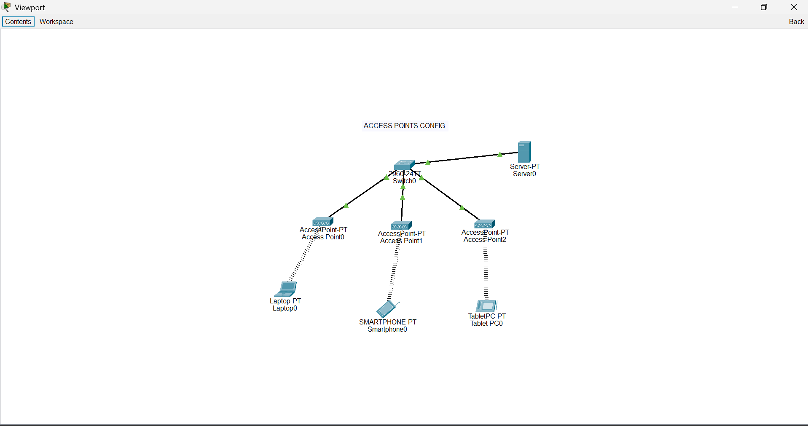
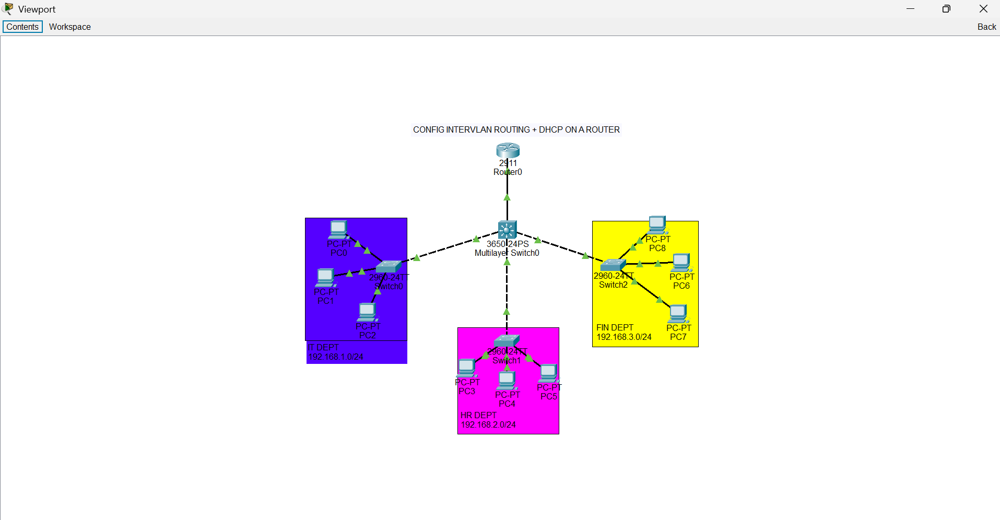
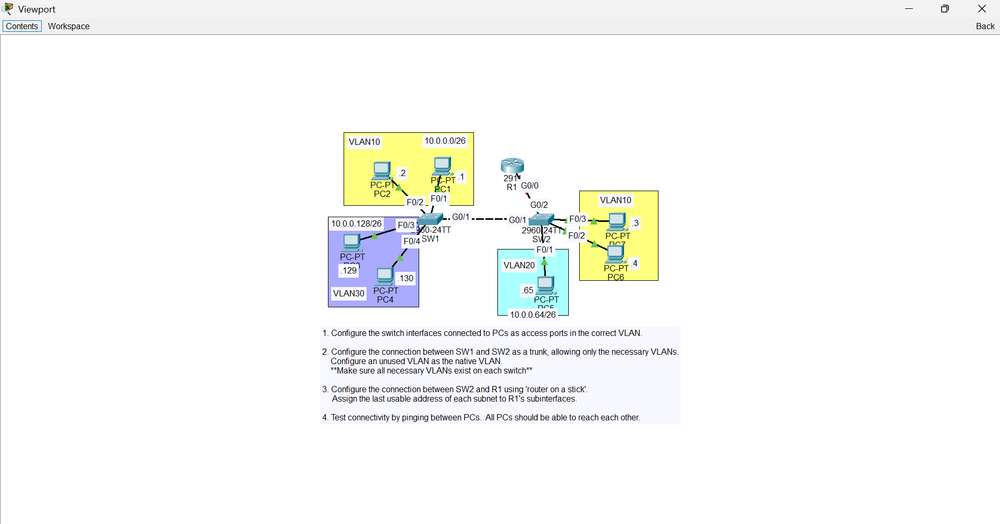
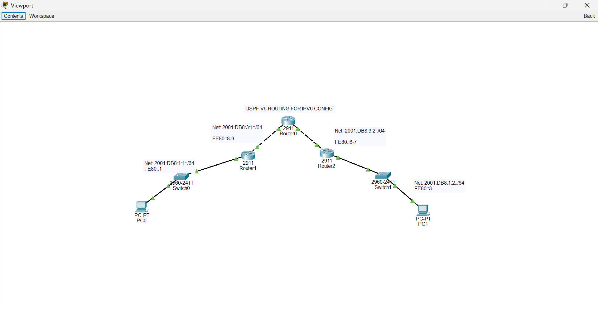

# Cisco Network Infrastructure Lab

## Overview

This project documents my hands-on practice designing and configuring a small network infrastructure using Cisco Packet Tracer.

The lab was created as part of my practical learning in networking and cybersecurity, with a focus on understanding how devices communicate and how network services are configured.

## Objectives

- Design a functional small-scale network
- Configure VLANs for network segmentation
- Configure DHCP for automatic IP address assignment
- Configure DNS-related network services
- Practice IP addressing and subnetting
- Test connectivity between network devices
- Troubleshoot common network connectivity issues

## Technologies & Tools

- Cisco Packet Tracer
- Cisco networking concepts
- VLANs
- DHCP
- DNS
- IPv4 addressing
- Network segmentation
- Basic network troubleshooting

## Skills Demonstrated

- Network topology design
- IP addressing
- VLAN configuration
- DHCP configuration
- DNS concepts
- Network connectivity testing
- Troubleshooting
- Understanding of LAN infrastructure

## What I Learned

This project helped me strengthen my understanding of how different components of a network work together.

I gained practical experience with network segmentation, IP addressing, DHCP, DNS, and troubleshooting connectivity problems. It also helped me connect the theoretical concepts from my Cybersecurity degree with hands-on networking practice.

## Career Direction
This project supports my long-term goal of developing deeper expertise in network engineering and cybersecurity.

I am particularly interested in building secure, reliable network infrastructure and continuing to develop my skills through advanced study and practical projects.

## Practical Evidence

### 1. Access Point Configuration

This exercise demonstrates practical configuration and understanding of wireless network infrastructure.

### 2. Inter-VLAN Routing and DHCP

This exercise demonstrates network segmentation using VLANs and configuration of DHCP services for network connectivity.

### 3. Networking Exercise

This exercise documents practical networking configuration and troubleshooting work completed during my hands-on learning.

### 4. OSPFv6 and IPv6 Routing

This exercise demonstrates practical exposure to IPv6 networking and OSPFv3/OSPFv6 routing concepts.

